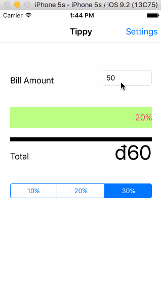

# Tippy Calculator

This is a Tippy Calculator application for iOS submitted as the [pre-work](http://courses.coderschool.vn/swift/prework) requirement for CoderSchool.

Time spent: 16 hours

Completed:

* [x] Required: TipViewController And SettingsViewController
* [x] Required: Add Github
* [x] Optional: GIF file
* [x] Optional: CC codeschool

GIF created with [LiceCap](http://www.cockos.com/licecap/).